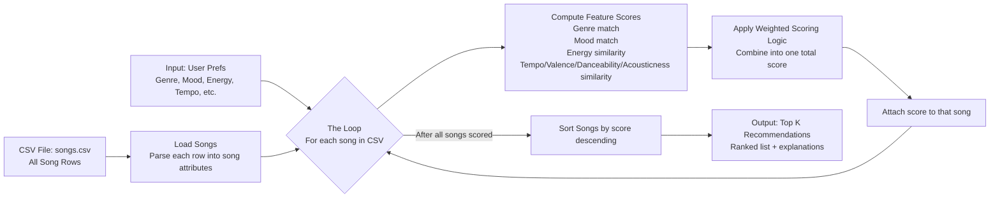
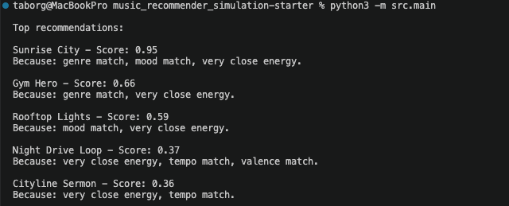
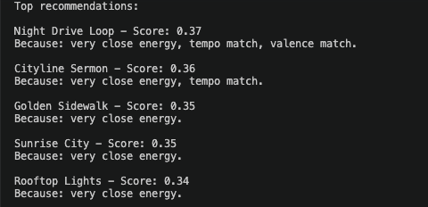

# 🎵 Music Recommender Simulation

## Project Summary

In this project you will build and explain a small music recommender system.

Your goal is to:

- Represent songs and a user "taste profile" as data
- Design a scoring rule that turns that data into recommendations
- Evaluate what your system gets right and wrong
- Reflect on how this mirrors real world AI recommenders

Replace this paragraph with your own summary of what your version does.

---

## How The System Works

Explain your design in plain language.

Some prompts to answer:

- What features does each `Song` use in your system
  - For example: genre, mood, energy, tempo
    - The features used are Genre for matching , mood for user's preference and energy for user's context
- What information does your `UserProfile` store
    - stores user's preferences
- How does your `Recommender` compute a score for each song
    - It computes score using user's preferred genre, mood and energy closeness and then ranks by total score.        
- How do you choose which songs to recommend
    - Recommended songs based on  user profile that is with closest match to user preferences.
You can include a simple diagram or bullet list if helpful.



### Finalized Algorithm Recipe

1. Load the song catalog from `data/songs.csv`.
2. Read user preferences (genre, mood, target energy, target tempo, target valence, target danceability, target acousticness).
3. For each song, compute feature-level scores:
    - Genre match: 1 if exact match, else 0
    - Mood match: 1 if exact match, else 0
    - Energy similarity: closeness to target energy in [0, 1]
    - Tempo similarity: closeness to preferred tempo in [0, 1]
    - Valence similarity: closeness to target valence in [0, 1]
    - Danceability similarity: closeness to target danceability in [0, 1]
    - Acousticness similarity: closeness to preferred acousticness in [0, 1]
4. Combine feature scores with weighted scoring:
    - 0.35 * genre + 0.25 * mood + 0.20 * energy + 0.08 * tempo + 0.05 * valence + 0.04 * danceability + 0.03 * acousticness
5. Save the song with its total score and explanation tags.
6. Sort all songs by score (highest first).
7. Return the top K songs as recommendations.

### Brief Note on Potential Biases

- Genre over-prioritization: Because genre has the highest weight (0.35), the system can rank a genre match above a song that better matches the user's current mood and listening context.
- Exact-match rigidity: Genre and mood are binary matches (1 or 0), so near-neighbor genres or related moods are not rewarded.
- Small-catalog bias: With only a small song set, the system may repeatedly push the same songs and underrepresent variety.
- Feature omission bias: The recommender ignores lyrics, language, culture, and novelty, so songs that users might love for those reasons can be missed.


---

## CLI Verification


### Stress Test with Diverse Profile

---

## Getting Started

### Setup

1. Create a virtual environment (optional but recommended):

   ```bash
   python -m venv .venv
   source .venv/bin/activate      # Mac or Linux
   .venv\Scripts\activate         # Windows

2. Install dependencies

```bash
pip install -r requirements.txt
```

3. Run the app:

```bash
python -m src.main
```

### Running Tests

Run the starter tests with:

```bash
pytest
```

You can add more tests in `tests/test_recommender.py`.

---

## Demo Profiles and Expected Top 3

The examples below use the current scoring logic in `src/recommender.py` with weighted similarity across genre, mood, energy, tempo, valence, danceability, and acousticness.

### Vibe A: Intense Rock

Sample user preferences:

- genre: rock
- mood: intense
- energy: 0.92
- tempo_bpm: 145
- valence: 0.50
- danceability: 0.62
- acousticness: 0.10
- likes_acoustic: false

Expected top 3 songs:

1. Storm Runner
2. Gym Hero
3. Steel Pulse Theory

### Vibe B: Chill Lofi

Sample user preferences:

- genre: lofi
- mood: chill
- energy: 0.38
- tempo_bpm: 78
- valence: 0.58
- danceability: 0.60
- acousticness: 0.80
- likes_acoustic: true

Expected top 3 songs:

1. Midnight Coding
2. Library Rain
3. Focus Flow

---

## Experiments You Tried

Use this section to document the experiments you ran. For example:

- What happened when you changed the weight on genre from 2.0 to 0.5
- What happened when you added tempo or valence to the score
- How did your system behave for different types of users

---

## Limitations and Risks

Summarize some limitations of your recommender.

Examples:

- It only works on a tiny catalog
- It does not understand lyrics or language
- It might over favor one genre or mood

You will go deeper on this in your model card.

---

## Reflection

Read and complete `model_card.md`:

[**Model Card**](model_card.md)

Write 1 to 2 paragraphs here about what you learned:

- about how recommenders turn data into predictions
- about where bias or unfairness could show up in systems like this


---

## 7. `model_card_template.md`

Combines reflection and model card framing from the Module 3 guidance. :contentReference[oaicite:2]{index=2}  

```markdown
# 🎧 Model Card - Music Recommender Simulation

## 1. Model Name

Give your recommender a name, for example:

> VibeFinder 1.0

---

## 2. Intended Use

- What is this system trying to do
- Who is it for

Example:

> This model suggests 3 to 5 songs from a small catalog based on a user's preferred genre, mood, and energy level. It is for classroom exploration only, not for real users.

---

## 3. How It Works (Short Explanation)

Describe your scoring logic in plain language.

- What features of each song does it consider
- What information about the user does it use
- How does it turn those into a number

Try to avoid code in this section, treat it like an explanation to a non programmer.

---

## 4. Data

Describe your dataset.

- How many songs are in `data/songs.csv`
- Did you add or remove any songs
- What kinds of genres or moods are represented
- Whose taste does this data mostly reflect

---

## 5. Strengths

Where does your recommender work well

You can think about:
- Situations where the top results "felt right"
- Particular user profiles it served well
- Simplicity or transparency benefits

---

## 6. Limitations and Bias

Where does your recommender struggle

Some prompts:
- Does it ignore some genres or moods
- Does it treat all users as if they have the same taste shape
- Is it biased toward high energy or one genre by default
- How could this be unfair if used in a real product

---

## 7. Evaluation

How did you check your system

Examples:
- You tried multiple user profiles and wrote down whether the results matched your expectations
- You compared your simulation to what a real app like Spotify or YouTube tends to recommend
- You wrote tests for your scoring logic

You do not need a numeric metric, but if you used one, explain what it measures.

---

## 8. Future Work

If you had more time, how would you improve this recommender

Examples:

- Add support for multiple users and "group vibe" recommendations
- Balance diversity of songs instead of always picking the closest match
- Use more features, like tempo ranges or lyric themes

---

## 9. Personal Reflection

A few sentences about what you learned:

- What surprised you about how your system behaved
- How did building this change how you think about real music recommenders
- Where do you think human judgment still matters, even if the model seems "smart"


